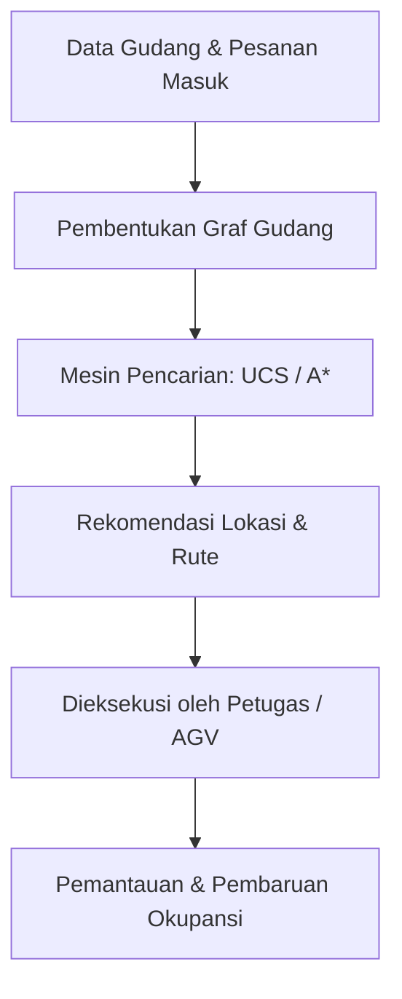
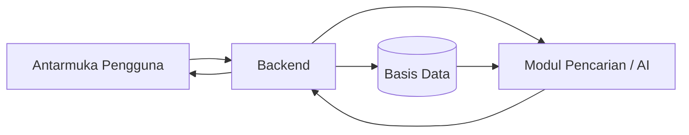

# Smart Warehouse Agent

### Agen Cerdas Berbasis Pencarian untuk Optimasi Penyimpanan & Pengambilan Barang di Gudang

[](https://www.python.org/)
[](https://docs.astral.sh/uv/)
[](LICENSE)
[](#rencana-pengembangan-roadmap)

Smart Warehouse Agent adalah proyek AI mahasiswa yang dikembangkan bertahap selama satu semester untuk membantu pengelola gudang menemukan lokasi penyimpanan barang terbaik (*put-away*) dan jalur pengambilan barang tercepat (*retrieval*).

---

## Isi Dokumen

1. [Ringkasan Proyek](#ringkasan-proyek)
2. [Tujuan](#tujuan)
3. [Latar Belakang Masalah](#latar-belakang-masalah)
4. [Pendekatan AI yang Digunakan](#pendekatan-ai-yang-digunakan)
5. [Spesifikasi PEAS](#spesifikasi-peas)
6. [Kemampuan Sistem](#kemampuan-sistem)
7. [Alur Kerja Sistem](#alur-kerja-sistem)
8. [Arsitektur Sistem](#arsitektur-sistem)
9. [Rencana Pengembangan (Roadmap)](#rencana-pengembangan-roadmap)
10. [Struktur Direktori](#struktur-direktori)
11. [Persiapan & Instalasi](#persiapan--instalasi)
12. [Menjalankan Program](#menjalankan-program)
13. [Studi Kasus](#studi-kasus)
14. [Rencana Lanjutan](#rencana-lanjutan)
15. [Anggota Tim](#anggota-tim)
16. [Lisensi](#lisensi)

---

## Ringkasan Proyek

Di banyak gudang, keputusan meletakkan dan mengambil barang masih mengandalkan intuisi staf, bukan perhitungan sistematis atas jarak tempuh, kepadatan lorong, maupun karakteristik barang itu sendiri. Akibatnya, ruang penyimpanan kerap tidak terpakai secara maksimal, proses pengambilan barang memakan waktu lebih lama dari seharusnya, dan peluang salah taruh barang pun meningkat.

Untuk menjawab hal ini, Smart Warehouse Agent merepresentasikan denah gudang sebagai sebuah **graf berbobot**: setiap titik (node) mewakili lokasi fisik seperti dock penerimaan, persimpangan lorong, atau slot rak, sementara setiap sisi (edge) mewakili jarak maupun waktu tempuh sesungguhnya antar-titik tersebut. Berbekal model ini, agen menjalankan algoritma pencarian pada ruang keadaan (*state-space search*) untuk memutuskan slot penyimpanan mana yang paling optimal dan rute pengambilan mana yang paling murah biayanya.

Perlu digarisbawahi, proyek ini **bukan** aplikasi pencatatan stok biasa (WMS konvensional). Nilai kecerdasannya justru terletak pada bagaimana persoalan gudang diterjemahkan menjadi masalah pencarian pada graf, lengkap dengan algoritma yang membuktikan solusinya optimal.

## Tujuan

- Menekan total jarak/waktu tempuh selama proses put-away maupun picking.
- Mendorong pemanfaatan ruang penyimpanan gudang seoptimal mungkin.
- Menurunkan potensi salah taruh atau salah ambil barang akibat keputusan manual.
- Menghadirkan baseline algoritma pencarian (UCS & A*) sebagai pijakan awal optimasi keputusan penyimpanan dan rute.
- Membuka ruang pengembangan lanjutan berupa prediksi permintaan dan slotting yang adaptif.

## Latar Belakang Masalah

Beberapa persoalan nyata yang melatarbelakangi proyek ini:

- Rak penyimpanan tidak terisi optimal karena barang kerap ditaruh di slot yang tidak cocok dengan kategori/ukurannya.
- Durasi pengambilan barang (picking time) membengkak sebab barang yang laris (fast-moving) belum tentu berada di titik yang strategis.
- Salah catat lokasi barang memperbesar risiko selisih data stok.
- Penempatan barang masih bersifat reaktif, belum memperhitungkan pola permintaan atau keterkaitan antar-pesanan.
- Sistem manual sulit menyesuaikan diri ketika volume pesanan melonjak, misalnya pada momen promosi besar.

## Pendekatan AI yang Digunakan

Proyek ini memisahkan dengan jelas antara pemodelan graf gudang dan algoritma pencarian yang menghasilkan keputusan akhir. Pendekatan lanjutan seperti prediksi permintaan baru akan ditentukan setelah data historis tersedia dan sempat dievaluasi — dokumen ini tidak mengunci satu metode tertentu sebagai bentuk final.

**Pemodelan Graf Gudang.** Denah gudang diubah menjadi graf berbobot: node mewakili dock, persimpangan lorong, dan slot rak; edge mewakili jarak/waktu tempuh sesungguhnya. Model inilah yang menopang seluruh proses pencarian berikutnya.

**Pencarian Baseline: UCS & A\*.** *Uniform Cost Search* (UCS) dipakai sebagai baseline yang menjamin lintasan berbiaya minimum, dihitung dari akumulasi biaya riil g(n). *A\* Search* mempercepat proses ini dengan tambahan heuristik jarak Manhattan h(n) yang admissible pada denah gudang berbentuk grid, sehingga f(n) = g(n) + h(n) tetap menjamin solusi optimal namun dengan node yang dijelajahi lebih sedikit.

**Rekomendasi Slotting.** Rekomendasi lokasi penyimpanan memadukan aturan sederhana (kategori barang, tingkat perputaran/turnover) dengan hasil pencarian biaya rute, sehingga barang yang laku cepat diarahkan ke slot dengan biaya akses paling rendah.

**Slotting Berbasis Permintaan (pengembangan lanjutan).** Bila data penjualan historis mencukupi, model prediksi permintaan dapat dilatih pada milestone berikutnya agar slotting mampu menyesuaikan diri dengan pola musiman. Metode yang dipakai akan ditetapkan setelah karakteristik datanya dipelajari.

## Spesifikasi PEAS

| Komponen | Penjabaran pada Smart Warehouse Agent |
| --- | --- |
| **Performance Measure** | Total jarak/waktu tempuh put-away & picking, tingkat pemanfaatan ruang penyimpanan, rata-rata waktu penyelesaian pesanan, tingkat kesalahan penempatan/pengambilan, serta pemerataan beban antar-lorong. |
| **Environment** | Denah gudang berupa graf rak/lorong, status keterisian tiap slot, atribut SKU (dimensi, berat, kategori, turnover rate), dan antrean pesanan masuk/keluar. |
| **Actuators** | Perintah gerak ke AGV/perangkat genggam petugas, pembaruan status slot pada sistem WMS, instruksi ke conveyor/sorter, serta pembaruan pick-list digital/label rak. |
| **Sensors** | Pemindai barcode/RFID, sensor berat & dimensi di dock penerimaan, kamera/computer vision untuk memantau keterisian dan kepadatan lorong, dan feed data real-time dari WMS/ERP. |

## Kemampuan Sistem

- **Pemodelan Graf Gudang** — mengubah denah gudang menjadi graf berbobot lengkap dengan jarak/waktu tempuh antar-titik.
- **Rekomendasi Put-away** — menyarankan lokasi penyimpanan optimal memakai baseline UCS.
- **Optimasi Rute Pengambilan** — menghitung rute pengambilan tercepat memakai A* dengan heuristik Manhattan distance.
- **Perbandingan Biaya & Performa** — membandingkan biaya lintasan serta jumlah node yang dijelajahi antara UCS dan A*.
- *(Lanjutan)* **Kesadaran Slot Stok** — rekomendasi slotting berdasarkan kategori dan turnover barang.
- *(Lanjutan)* **Slotting Berbasis Permintaan** — penyesuaian slotting mengikuti prediksi pola permintaan.

## Alur Kerja Sistem



## Arsitektur Sistem



- **Antarmuka Pengguna** — tempat petugas/pengelola gudang memasukkan data barang & pesanan, sekaligus melihat rekomendasi dan peringatan.
- **Backend** — menangani validasi input, pembentukan graf gudang, serta komunikasi antar-komponen.
- **Basis Data** — menyimpan data denah gudang, SKU, okupansi rak, dan histori transaksi.
- **Modul Pencarian/AI** — menjalankan UCS/A*, dan pada milestone lanjutan turut menjalankan model prediksi permintaan.

## Rencana Pengembangan (Roadmap)

| Milestone | Fokus Utama | Luaran |
| --- | --- | --- |
| **M1** | Perumusan Masalah & Perencanaan Proyek | Business problem framing, spesifikasi PEAS, formulasi ruang keadaan (X, A, T, G, C), baseline UCS/A*, dan repositori GitHub awal. |
| **M2** | Pengumpulan & Pemahaman Data | Skema data denah gudang, atribut SKU, histori pesanan, serta evaluasi awal kualitas data. |
| **M3** | Pemrosesan Data & Pengembangan Model AI | Pra-pemrosesan data, perluasan graf gudang, eksplorasi model prediksi permintaan, dan evaluasi awal algoritma pencarian pada skala lebih besar. |
| **M4** | Integrasi Sistem & Dashboard | Penggabungan modul pencarian, slotting, penyimpanan data, serta dashboard visualisasi denah gudang. |
| **M5** | Pengujian, Evaluasi & Presentasi Akhir | Pengujian sistem, evaluasi hasil, pembahasan keterbatasan, dokumentasi, dan presentasi akhir. |

## Struktur Direktori

Baseline UCS & A* yang sudah berjalan berada pada `src/warehouse_search.py`. Folder-folder lain disiapkan lebih dulu untuk kebutuhan milestone selanjutnya.

```text
smart-warehouse-agent/
├── README.md
├── LICENSE
├── .gitignore
├── pyproject.toml
├── requirements.txt
├── src/
│   └── warehouse_search.py
├── data/
│   ├── raw/
│   └── processed/
├── notebooks/
├── tests/
└── docs/
```

## Persiapan & Instalasi

### Yang perlu disiapkan

- Python versi **3.10 ke atas**.
- [Astral `uv`](https://docs.astral.sh/uv/getting-started/installation/) sudah terpasang pada `PATH`.
- Git untuk mengambil dan mengelola repository ini.

### Membangun environment

Dari root repository, jalankan:

```bash
uv venv
uv sync
```

Mengaktifkan environment (opsional):

```bash
# Windows PowerShell
.venv\Scripts\Activate.ps1

# Linux/macOS
source .venv/bin/activate
```

Daftar dependency ada pada `pyproject.toml`. Untuk saat ini belum ada dependency eksternal yang ditambahkan, sebab baseline UCS/A* hanya memanfaatkan pustaka standar Python. Tambahkan dependency baru dengan `uv add <nama-paket>` hanya jika benar-benar dibutuhkan implementasi.

## Menjalankan Program

Baseline UCS & A* untuk rekomendasi put-away dan retrieval ada pada `src/warehouse_search.py`, dengan alur kerja:

```text
Denah gudang (graf & koordinat)
→ representasi state (posisi pada graf)
→ UCS dengan f(n) = g(n)
→ A* dengan f(n) = g(n) + h(n)  [heuristik Manhattan distance]
→ rekomendasi lintasan put-away/retrieval berbiaya paling rendah
```

Contoh baseline dapat dijalankan dari root repository:

```bash
uv run python src/warehouse_search.py
```

Contoh ini memakai graf gudang dengan satu dock penerimaan, empat persimpangan lorong, dan lima slot rak. State/node adalah posisi pada graf, action/edge adalah perpindahan antar-titik, sedangkan cost adalah jarak/waktu tempuh sesungguhnya. UCS dan A* sama-sama mencari lintasan berbiaya paling rendah dari dock menuju slot rak tujuan.

Modul ini hanyalah salah satu bagian dari Smart Warehouse Agent untuk mendukung keputusan penyimpanan dan pengambilan barang — bukan sistem manajemen armada AGV secara utuh, dan bukan pula sistem ERP/WMS lengkap.

Untuk memastikan environment Python sudah siap dipakai:

```bash
uv run python --version
```

## Studi Kasus

Misalkan Gudang Nusantara Logistik baru saja menerima kiriman barang dan perlu menetapkan slot penyimpanan sekaligus rute pengambilan yang paling efisien:

1. barang tiba di dock penerimaan dan atributnya dicatat (dimensi, berat, kategori);
2. sistem membentuk graf gudang berdasarkan denah lorong dan rak yang berlaku saat ini;
3. algoritma UCS/A* mencari lintasan berbiaya (jarak/waktu) paling rendah dari dock menuju slot rak tujuan;
4. sistem memberikan rekomendasi lokasi penyimpanan dan/atau rute pengambilan yang optimal; dan
5. petugas atau AGV menjalankan instruksi actuator untuk menuntaskan proses put-away maupun picking.

## Rencana Lanjutan

Beberapa arah pengembangan berikut masih terbuka untuk dipertimbangkan, menyesuaikan kebutuhan, ketersediaan data, serta hasil evaluasi proyek ke depannya:

- menghadirkan model prediksi permintaan (demand forecasting) untuk slotting yang adaptif;
- mengembangkan koordinasi multi-agent bagi beberapa AGV/petugas sekaligus;
- menambahkan penalti kongesti yang dinamis pada fungsi biaya (cost function);
- membangun dashboard visual untuk denah gudang dan status okupansi rak; dan
- menguji algoritma pencarian pada graf gudang berskala jauh lebih besar dan kompleks.

Daftar di atas adalah kemungkinan arah pengembangan, bukan klaim bahwa fitur tersebut sudah tersedia atau bersifat final.

## Anggota Tim

| Nama | NIM | Peran |
| --- | --- | --- |
| Nicolas J Grace Butarbutar | NIM | Algorithm Engineer & Repo Setup |
| Indah | NIM | Business Analyst / Problem Framer |
| Swasti | NIM | PEAS Specialist & Dokumentasi |

## Lisensi

Repositori ini dilisensikan di bawah **MIT License**. Ketentuan selengkapnya dapat dilihat pada berkas [LICENSE](LICENSE).

---

*Disusun untuk memenuhi rangkaian proyek terpadu mata kuliah **10S3001 - Kecerdasan Buatan**, Program Studi Sarjana Sistem Informasi, Institut Teknologi Del, Semester Gasal 2026/2027, di bawah bimbingan dosen pengampu **Samuel Indra Gunawan Situmeang**.*
